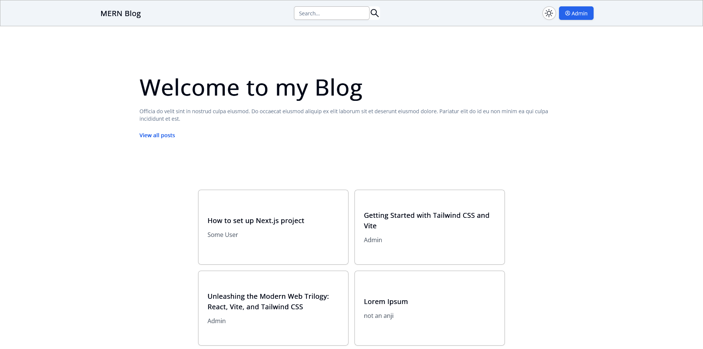
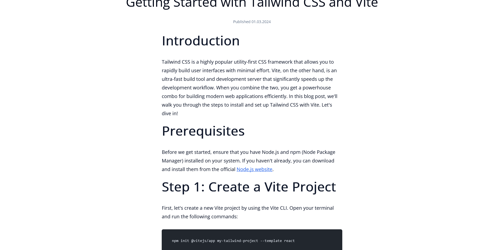
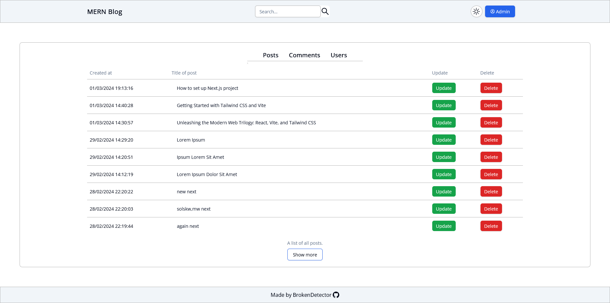

# MERN Blog Application

Blog Application built with MongoDB, Express, React and Nodejs.

### Main page

### Post page

### Admin Dashboard page

## Features

- User authentication using JWTs
- Securing passwords using bcryptjs
- See posts and comments as well as their author and creation time
- Create, Delete and Update comments (only for registered users and administrators)
- Create, Delete and Update posts (only for administrators)
- Search posts by title
- Admin panel, where all posts, comments and registered users are shown (only for admins, of course)
- User can delete his account

## Technologies used

- Typescript
- React
- Tailwindcss
- Schadcn/ui
- Node.js
- Express
- MongoDB
- Mongoose
- bcryptjs
